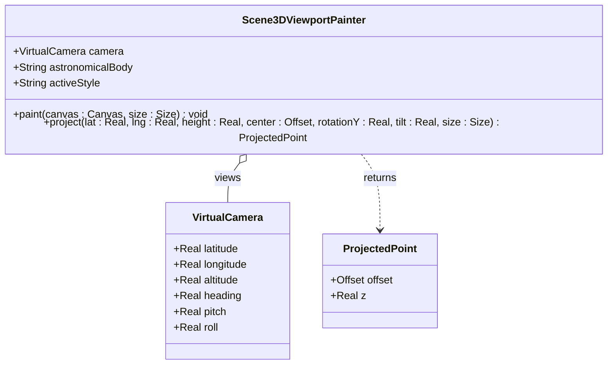

# Defect Design Solution: Perspective Ellipse Horizon Clamping & Ocean Alignment

- **Bug Issue**: [Issue #244: BUG: Perspective ellipse distortion and horizon mismatch under tilted camera](https://github.com/gintatkinson/3dgs-phoenix/issues/244)
- **Feature Area**: 3D Visualization Pipeline (`Scene3DViewportPainter`)

---

## 1. Bug Definition & Architectural Impact

### The Defect
When the camera is tilted relative to the Earth (pitch is not -90°), the perspective projection of the Earth sphere onto the 2D viewport is mathematically an **ellipse**, not a circle. 

The previous implementation suffered from two major defects:
1. **2D Circular Clamping**: Culled points behind the horizon were clamped in 2D to a circle centered at the screen center `center` or the projected Earth center `projectedCenter`. Since the actual projected silhouette is an ellipse, the circular clamped boundary did not align with the elliptical terrain tiles, creating jagged "notches" and flat cut-out edges on the horizon.
2. **2D Circular Ocean**: The ocean sphere background was drawn as a 2D circle via `canvas.drawCircle`. Under tilted pitch views, the elliptical land terrain drifted away from the circular ocean, leaving massive black gaps of space visible between the land and the bottom boundary of the Earth.

### Architectural UML Sequence Diagram

```mermaid
sequenceDiagram
    autonumber
    actor User as Viewport Render Loop
    participant Viewport as Scene3DViewportPainter
    participant Project as project()
    participant Engine as CesiumEngine
    participant Canvas as ui.Canvas

    User->>Viewport: paint(canvas, size)
    
    rect rgb(30, 40, 50)
        note right of Viewport: Dynamic 3D Horizon Circle Projection
        Viewport->>Project: project(lat, lng, alt) for 64 points on ECEF 3D Horizon Circle
        Project-->>Viewport: List of screen coordinates (elliptical path)
    end

    Viewport->>Canvas: drawPath(horizonPath, oceanPaint) [Perfect Elliptical Ocean]

    loop For each tile mesh vertex
        Viewport->>Project: project(lat, lng, height)
        
        rect rgb(40, 30, 30)
            note right of Project: Defect Mitigation: 3D ECEF Clamping
            Project->>Project: Check dot(p, c) < R^2
            alt isCulled
                Project->>Project: Clamp in 3D ECEF space to 3D Horizon Circle
            end
        end

        Project-->>Viewport: ProjectedPoint(Offset, depth)
    end

    Viewport->>Canvas: drawPath(tilePath, tilePaint) [Perfect Alignment]
```

### UML Class Diagram (3D Viewport Painter)

---

## 2. Mathematical Specification of the Fix

Let $\mathbf{c} = (c_x, c_y, c_z)$ be the camera's position vector in ECEF space, and $d = \|\mathbf{c}\|$ be the camera's distance from the Earth's center.
Let $\mathbf{p} = (p_x, p_y, p_z)$ be the vertex coordinate in ECEF. The Earth's radius is $R = 6378137.0$ meters.

### 1. Horizon Culling Condition
A point $\mathbf{p}$ lies on the back-facing (culled) side of the sphere's horizon if:
$$\mathbf{p} \cdot \mathbf{c} < R^2$$

### 2. 3D ECEF Horizon Clamping
If the point is culled, we clamp $\mathbf{p}$ onto the 3D horizon circle (radius $R_{horizon}$ at distance $h = R^2/d$ along $\mathbf{c}$):
1. **Parallel component** along the camera axis:
   $$\mathbf{p}_{par} = \frac{R^2}{d^2} \mathbf{c}$$
2. **Perpendicular component** relative to the camera axis:
   $$\mathbf{p}_{perp} = \mathbf{p} - \frac{\mathbf{p} \cdot \mathbf{c}}{d^2} \mathbf{c}$$
3. **Horizon circle radius**:
   $$R_{horizon} = R \sqrt{1 - \frac{R^2}{d^2}}$$
4. **Clamped ECEF coordinate**:
   $$\mathbf{p}_{clamped} = \mathbf{p}_{par} + R_{horizon} \frac{\mathbf{p}_{perp}}{\|\mathbf{p}_{perp}\|}$$

This clamped ECEF coordinate is then transformed into camera space and projected onto the viewport. Because $\mathbf{p}_{clamped}$ lies exactly on the 3D horizon circle, its projected screen offset aligns perfectly with the perspective elliptical boundary of the globe.

---

## 3. Verification Plan

- **Test Case**: `Horizon clamping centers on projected Earth center under tilted camera` validates that the distance of any clamped point from the projected center of the Earth is exactly equal to the perspective silhouette radius $R_{proj}$ (confirming it lies on the ellipse).
