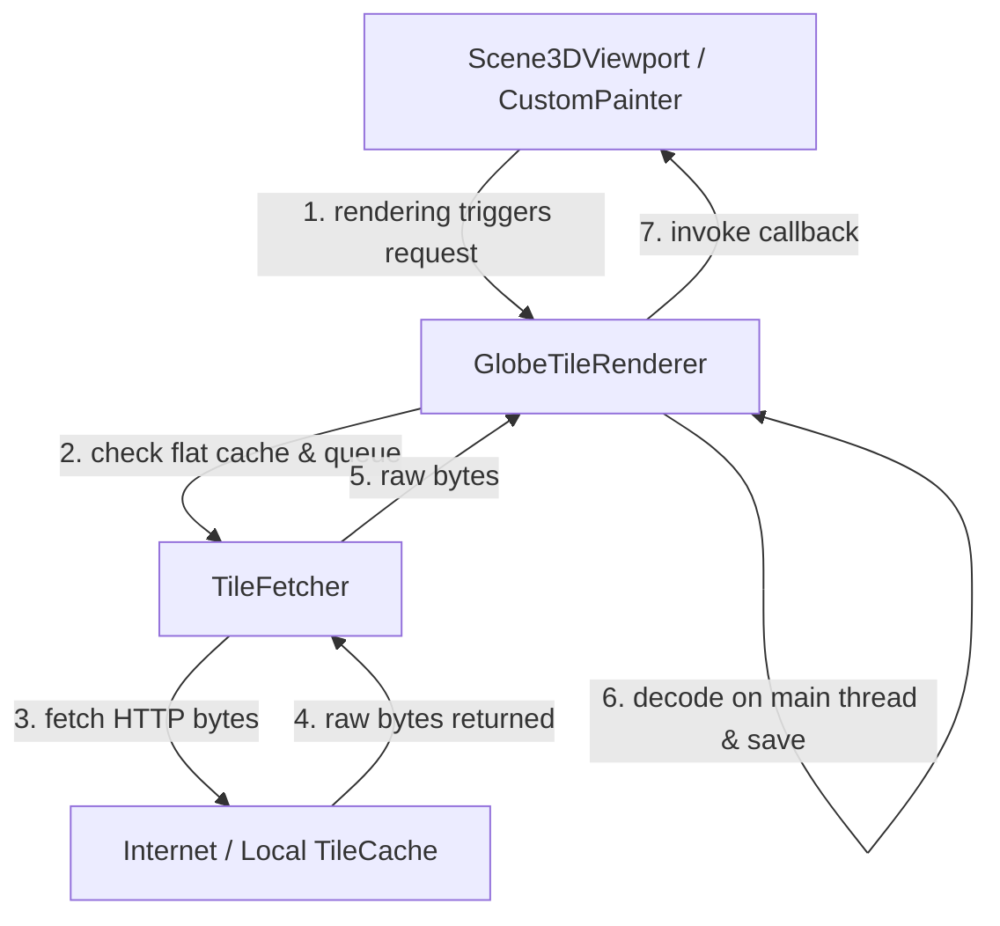
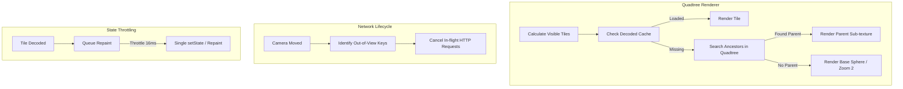

# Tiling Performance Analysis & Solution Proposal

## 1. Executive Summary

During camera navigation of the 3D globe, users experience noticeable visual "flashing" (rendering holes/patchworks) and frame-rate drops (jank). This report analyzes the tile rendering, fetching, and caching pipelines across `globe_tile_renderer.dart`, `tile_fetcher.dart`, and `scene_3d_viewport.dart`. 

We identify the root causes as **cache size mismatch (thrashing)**, **lack of hierarchical/parent-tile fallback rendering**, **un-cancelable network requests**, and **unthrottled repaint cycles (`setState` storms)**. 

We propose a concrete, high-performance architectural solution utilizing a **Quadtree Tile Registry with Ancestor Fallbacks**, **request lifecycle management (cancellation)**, and **debounced state notifications**.

---

## 2. Component Architecture Overview

The tiling pipeline consists of three core layers:



1. **`Scene3DViewportPainter`**: Projects WGS84 ECEF/geographic coordinates to screen coordinates and calls `GlobeTileRenderer.renderTiles`.
2. **`GlobeTileRenderer`**: Calculates visible tiles, manages decoded `ui.Image` cache (`_loadedImages`, max 64), and initiates asynchronous fetches.
3. **`TileFetcher`**: Downloads raw map images and caches raw byte buffers in an LRU memory cache (`TileCache`, max 256).

---

## 3. Root Cause Analysis

### 3.1. Cache Thrashing due to Capacity Mismatch (Primary Cause of Flashing)
In `globe_tile_renderer.dart`, the visible tile selection fetches tiles from three tiers:
- **Tier 1 (Zoom 2)**: Always 16 base tiles.
- **Tier 2 (Zoom Z-2)**: A $6 \times 6$ grid (up to 36 tiles).
- **Tier 3 (Zoom Z)**: A $5 \times 5$ grid (up to 25 tiles).

$$\text{Maximum Visible Tiles} = 16 + 36 + 25 = 77 \text{ tiles}$$

However, the decoded image cache `_loadedImages` in `GlobeTileRenderer` is hardcoded to a maximum size of **64**:
```dart
if (_loadedImages.length > 64) {
  _loadedImages.remove(_loadedImages.keys.first);
}
```
Because the maximum visible tiles ($77$) exceeds the cache limit ($64$), the renderer enters an **infinite cache thrashing loop**:
1. It requests the 77 visible tiles.
2. As tile 65 and above are decoded and inserted, older tiles currently visible in the viewport are evicted.
3. On the next frame, the evicted visible tiles are missing, so the renderer requests them again.
4. This causes constant network requests, re-decodes, and visual "holes" (flashing) on the screen.

### 3.2. Lack of Hierarchical Fallback Rendering (Visual Holes)
When a tile at zoom $Z$ is not yet loaded (or has been thrashed/evicted), `GlobeTileRenderer.renderTiles` has no spatial fallback logic. 
- It sorts loaded images by zoom and draws them sequentially.
- If a tile coordinate is missing from `_loadedImages`, its portion of the sphere is not rendered at that zoom level, falling back immediately to the base ocean sphere or highly-pixelated Zoom 2 tiles. This sudden resolution drop creates a high-contrast flashing effect.

### 3.3. Redundant Main-Thread Decodes
Although `TileFetcher` has a larger cache of 256 entries (`TileCache`), it only stores raw bytes (`Uint8List`). 
- When a tile is evicted from `GlobeTileRenderer`'s cache of 64 and then requested again, it bypasses the network but must be re-decoded from raw bytes via `ui.instantiateImageCodec`.
- Re-decoding dozens of PNGs/JPEGs during camera movements puts heavy pressure on the GPU/IO threads, creating micro-jank on the UI thread due to garbage collection and scheduling overhead.

### 3.4. Lack of Fetch Request Cancellation
In `tile_fetcher.dart`, requests are initiated without a cancellation mechanism:
```dart
final request = await _client.getUrl(uri);
final response = await request.close();
```
If the user pans the camera quickly, previously requested tiles that are no longer in the viewport continue to download and decode. Once complete, these stale tiles are inserted into `_loadedImages`, evicting the *newly visible* tiles and worsening the thrashing cycle.

### 3.5. Unthrottled `setState` Rebuilds
In `scene_3d_viewport.dart`, the viewport registers `onTileLoaded` to refresh the UI:
```dart
onTileLoaded: () {
  if (mounted) {
    setState(() {});
  }
}
```
When multiple tiles are fetched, each tile completion triggers an immediate, individual widget rebuild and repaint. During rapid panning, this causes dozens of repaints per frame, creating severe CPU rendering bottlenecks.

---

## 4. Proposed Architectural Solution

To eliminate jank and flashing, we propose a three-pronged optimization strategy:



### 4.1. Quadtree Tile Registry & Fallback Rendering
Introduce a hierarchical structure to track tile relationships.
1. **Ancestor Fallback**: If tile $(Z, X, Y)$ is not loaded, traverse up to its parent $(Z-1, X/2, y/2)$, grandparent, etc., in `_loadedImages`.
2. **Sub-Texture Projection**: When rendering an ancestor tile in place of a missing child, compute the UV texture coordinates representing the child's quadrant:
   - For example, if rendering a parent tile for the top-right child, restrict the texture coordinates to the range $[128, 256]$ horizontally and $[0, 128]$ vertically.
3. **Decoded Cache Pinning**: Increase the decoded image cache limit to **128** or **256**. Ensure that tiles currently in the active visible list are "pinned" and cannot be evicted by off-screen tiles.

### 4.2. Cancelable Request Lifecycle
Refactor `TileFetcher` to use cancelable requests or keep a set of active task controllers:
- Maintain a map of active requests: `Map<String, HttpClientRequest> _activeRequests`.
- When `beginTileFetch` runs, compare current visible tiles to active fetches.
- Abort/cancel requests for tiles that are no longer visible or within a close buffer zone.

### 4.3. Throttled UI Updates
Debounce or throttle the `onTileLoaded` notifications to prevent layout/repaint storms:
- Instead of calling `setState` immediately, accumulate loaded tiles in a queue.
- Use a throttler (e.g., using a short `Timer` or checking `SchedulerBinding`) to trigger a single `setState` at most once every 16ms (60 FPS).

---

## 5. Architectural Implementation Plan

### Phase 1: Decoded Cache Expansion & Pinned LRU
- Modify `GlobeTileRenderer` to increase decoded image capacity to `128` (safe headroom for the 77 max visible tiles).
- Implement a custom LRU cache that prevents eviction of tiles in the current frame's visible set.

### Phase 2: Implement Ancestor Fallback Rendering
- Add a helper function to find the nearest loaded ancestor coordinate for a given `TileCoord`.
- Update `GlobeTileRenderer.renderTiles` to calculate matching sub-texture UV ranges for ancestor tiles.
- Render the corresponding sub-mesh of the parent tile as a placeholder until the high-resolution child tile decodes.

### Phase 3: Cancelable Network Layer
- Integrate abort/cancel support in `TileFetcher.fetchTile` using Dart's `CancelableOperation` or tracking `HttpClientRequest` handles.
- Cancel fetches as soon as tiles fall out of the visible list.

### Phase 4: Repaint Throttler
- Implement a microtask-based or frame-boundary-based debouncer for `onTileLoaded` callbacks inside `Scene3DViewportState`.
