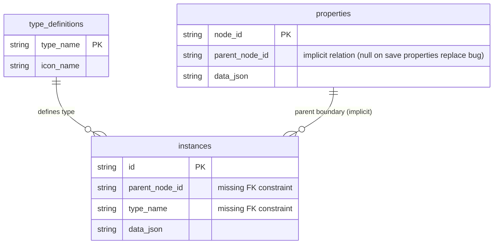

# DEFECT: Database Persistence, Schema Constraints, and Domain Mapping Failures

A systematic review of the database initialization, repository resolution, schema validators, and data sources has identified critical correctness, performance, and LSP violation defects.

---

## 1. UML Structural & Entity-Relationship Representation

### UML Domain Entity-Relationship Diagram: Properties & Instances Schema


### UML Liskov Substitution Violation Class Diagram (Issue 2.3)
```mermaid
classDiagram
    class DataSource {
        <<interface>>
        +fetchRootNodes() List~TreeNode~
        +fetchChildrenForNode(nodeId) List~TreeNode~
        +fetchTopologyData() TopologyData
    }
    class SqliteDataSource {
        +fetchRootNodes() List~TreeNode~
        +fetchChildrenForNode(nodeId) List~TreeNode~
        +fetchTopologyData() TopologyData
    }
    class FirebaseDataSource {
        +fetchRootNodes() List~TreeNode~ [Throws/Stubs]
        +fetchChildrenForNode(nodeId) List~TreeNode~ [Throws/Stubs]
        +fetchTopologyData() TopologyData [Throws/Stubs]
    }
    
    DataSource <|-- SqliteDataSource
    DataSource <|-- FirebaseDataSource
    Note for FirebaseDataSource "LSP Violation: Cannot substitute FirebaseDataSource without breaking UI tree rendering."
```

---

## 2. Defect Analysis & Locations

### Defect 2.1: Outdated Database Check Bug (Constant Database Recreation)
* **Severity**: 🔴 Critical
* **File**: `app_flutter/lib/domain/repository_resolver.dart` (Line 132)
* **Issue**: The detection of an outdated local database queries the count of type attributes with `attr_key = 'raw_json'`. However, no type attribute in the seed or production data has this key. Consequently, the query always returns `0`, causing `isOutdated` to be `true` on every startup, deleting and re-seeding the database from assets. This leads to total silent data loss for any local changes.
* **Proposed Correction**: Check if standard tables exist (e.g. via `sqlite_master`), query a dedicated `schema_version` metadata table, or remove this check in favor of standard SQLite migrations.

### Defect 2.2: Orphaning Child Nodes on Save Properties (Data Loss)
* **Severity**: 🔴 Critical
* **File**: `app_flutter/lib/domain/data_sources/sqlite_data_source.dart` (Lines 168-172)
* **Issue**: `saveProperties` calls `_db.insert` with `ConflictAlgorithm.replace` using a map containing only `node_id` and `data_json`. Because `parent_node_id` is omitted from this map, it is set to `NULL` in the replaced row. Saving properties for any nested child node silently orphans it, detaching it from the tree.
* **Proposed Correction**: Use SQL `ON CONFLICT` UPSERT syntax that only updates the `data_json` column and leaves `parent_node_id` untouched.

### Defect 2.3: Liskov Substitution Principle Violation in `FirebaseDataSource`
* **Severity**: 🔴 Critical
* **File**: `app_flutter/lib/domain/data_sources/firebase_data_source.dart` (Lines 255-267)
* **Issue**: Returning empty stubs for `fetchRootNodes()`, `fetchChildrenForNode()`, and `fetchTopologyData()` violates the contract of the `DataSource` interface. The `FirebaseDataSource` subclass cannot be substituted for `SqliteDataSource` without causing critical UI failures.
* **Proposed Correction**: Fully implement these methods using Firestore queries, or throw an explicit `UnimplementedError` so developers are immediately alerted to the architectural gap.

### Defect 2.4: Missing Database Indexes on `instances` Table (UI Hang)
* **Severity**: 🔴 Critical
* **File**: `app_flutter/lib/domain/database_initializer.dart` (Lines 83-89)
* **Issue**: The `instances` table is queried by `parent_node_id` and `type_name` in both `SqliteDataSource.fetchRelatedInstances` and `SqliteDataSource.fetchChildrenForNode`. Under a standard seed load containing up to 240,000 instances, SQLite runs a full table scan on every lookup, locking the UI thread and freezing the application.
* **Proposed Correction**: Add a composite index on `instances(parent_node_id, type_name)`.

---

## 3. Recommended Actions & Code Corrections

### Proposed Correction (Issue 2.2 - Save Properties UPSERT):
```dart
await _db.execute('''
  INSERT INTO properties (node_id, data_json)
  VALUES (?, ?)
  ON CONFLICT(node_id) DO UPDATE SET
    data_json = excluded.data_json
''', [nodeId, dataJson]);
```

### Proposed Correction (Issue 2.4 - DB Index):
```sql
CREATE INDEX IF NOT EXISTS idx_instances_parent_type
ON instances(parent_node_id, type_name);
```
