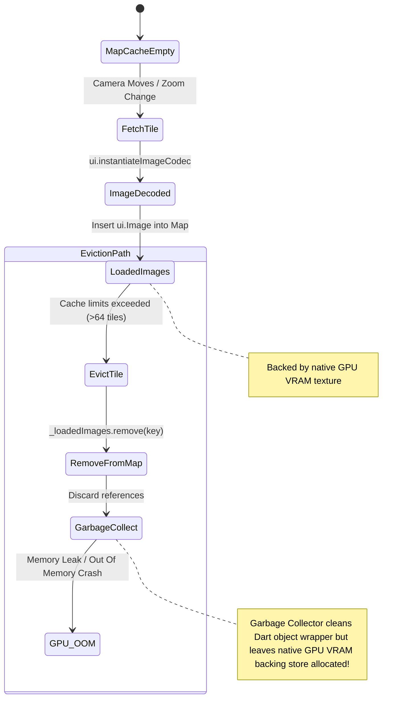
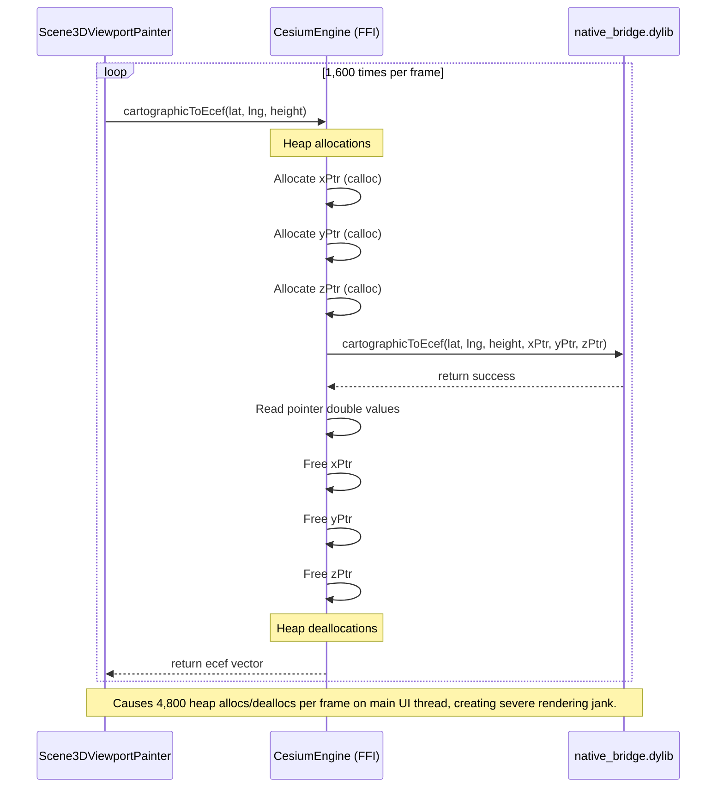

# DEFECT: 3D Geospatial Engine FFI Memory Leak, Double Free, and Infinite Loop Vulnerabilities

A systematic review of the 3D Geospatial projection engine, native FFI bridge bindings, and the camera controller has identified critical correctness, native safety, and memory management failures.

---

## 1. UML Architectural & Memory Lifecycle Representation

### UML State Diagram: GPU & Native Memory Leak on Eviction (Issue 3.3)


### UML Sequence Diagram: High-Allocation Vertex projection Loop (Issue 3.4)


---

## 2. Defect Analysis & Locations

### Defect 3.1: Infinite Loop on Non-Finite Coordinates in Angle Wrapping
* **Severity**: 🔴 Critical
* **File**: `app_flutter/lib/domain/cesium_3d/camera_controller.dart` (Lines 93-104 & 198-212)
* **Issue**: The angle wrapping functions `_wrapLng`, `_wrapHeadingStatic`, and `_wrapPitchStatic` use `while` loops to decrement or increment values:
  ```dart
  while (lng > 180) lng -= 360;
  ```
  If any input value propagates as `double.infinity` (which can happen during division-by-zero or mathematical edge cases in projection), the comparison `lng > 180` always remains true. This creates an infinite loop that freezes the main thread.
* **Proposed Correction**: Use the modulo operator to perform angle wrapping and explicitly check for `NaN` and `Infinite` double inputs.

### Defect 3.2: NaN Check Bypass in `VirtualCamera` Constructor
* **Severity**: 🔴 Critical
* **File**: `app_flutter/lib/domain/cesium_3d/virtual_camera.dart` (Lines 25-35)
* **Issue**: The `VirtualCamera` constructor performs range validations on coordinate properties, but comparisons with `NaN` always return `false`. A camera instantiated with `latitude: double.nan` bypasses this validation entirely. These values propagate to rendering functions where operations like `.floor()` on `NaN` values throw an `UnsupportedError` and crash the UI during paint cycles.
* **Proposed Correction**: Explicitly check for `isNaN` or `isInfinite` for all coordinate variables.

### Defect 3.3: GPU/Native Memory Leak: Missing `ui.Image` Disposal
* **Severity**: 🔴 Critical
* **File**: `app_flutter/lib/domain/cesium_3d/globe_tile_renderer.dart` (Lines 66 & 219)
* **Issue**: Flutter's `ui.Image` class is a thin wrapper around a native C++ object containing GPU texture backing store. In `setProvider()`, `_loadedImages.clear()` is called, and in `_fetchAndDecode()`, `_loadedImages.remove(...)` is called. In both cases, the image is discarded without calling `image.dispose()`. This creates a severe GPU memory leak, causing quick RAM/VRAM exhaustion and OOM crashes.
* **Proposed Correction**: Always call `.dispose()` on `ui.Image` instances when evicting or clearing the map.

### Defect 3.4: Native Double-Free Vulnerability in `NativeResource`
* **Severity**: 🔴 Critical
* **File**: `app_flutter/lib/domain/cesium_3d/native/native_resource.dart` (Lines 19-22)
* **Issue**: The `NativeResource.release()` method manually frees native pointers via `calloc.free(pointer)`. However, there are no checks to prevent multiple activations. Calling `release()` twice causes a **double-free** condition, corrupting the native allocator heap, crashing the application, and exposing potential arbitrary memory writes.
* **Proposed Correction**: Implement a `_isReleased` guard flag.

---

## 3. Recommended Actions & Code Corrections

### Proposed Correction (Issue 3.1 - Safe Angle Wrapping):
```dart
static double _wrapLngStatic(double lng) {
  if (lng.isNaN || lng.isInfinite) return 0.0;
  double w = (lng + 180.0) % 360.0;
  if (w < 0.0) w += 360.0;
  return w - 180.0;
}
```

### Proposed Correction (Issue 3.3 - Evict and Dispose):
```dart
if (_loadedImages.length > 64) {
  final firstKey = _loadedImages.keys.first;
  final evicted = _loadedImages.remove(firstKey);
  evicted?.dispose();
}
```
