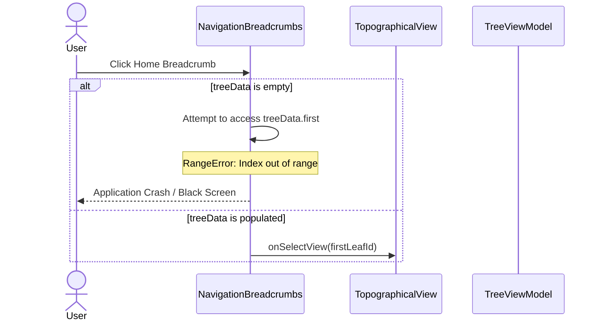
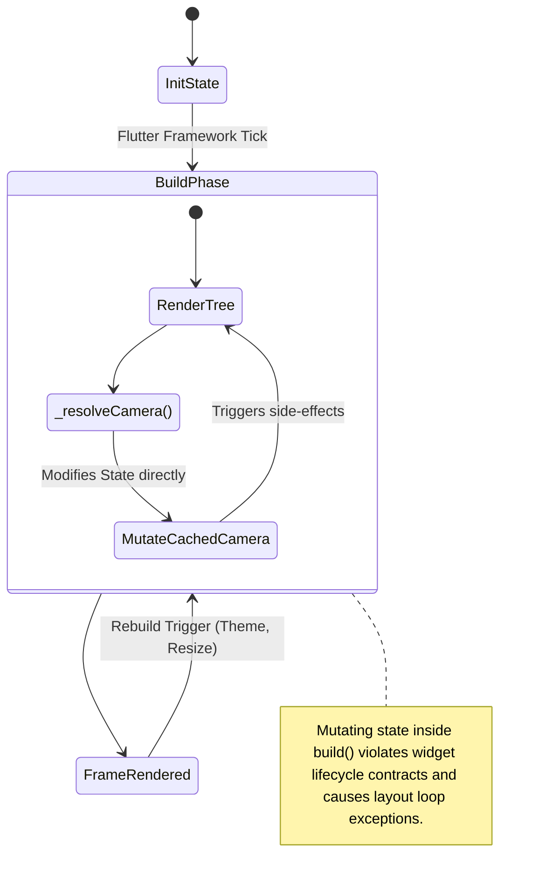

# DEFECT: UI Viewport and Workspace Layout Architecture Failures

A systematic review of the user interface viewport and workspace components has identified critical correctness, architectural, and performance failures. 

---

## 1. UML Structural & Sequence Representation

### UML Sequence Diagram: Breadcrumbs Empty Navigation Crash (Issue 1.1)


### UML Interaction State Diagram: State Mutation during Widget Build (Issue 1.2)


---

## 2. Defect Analysis & Locations

### Defect 1.1: Guaranteed Crash in Breadcrumbs Home Navigation (Empty State)
* **Severity**: 🔴 Critical
* **File**: `app_flutter/lib/features/layout/breadcrumbs.dart` (Lines 206-212)
* **Issue**: The root navigation handler contains a programming logic error. If the tree is empty (`treeData.isEmpty`), the code enters the `else` branch but still attempts to read `treeData.first`, resulting in a guaranteed `RangeError (IndexOutOfRange)` crash.
* **Proposed Correction**: Safely return or do nothing if `treeData` is empty.

### Defect 1.2: State Mutation in `build` Method of `TopographicalView`
* **Severity**: 🔴 Critical
* **File**: `app_flutter/lib/features/topology/topographical_view.dart` (Lines 94-140)
* **Issue**: `_resolveCamera()` mutates the state variables `_cachedCamera` and `_lastCurrentView` directly inside the widget's `build` method. `build` must be a pure function. Mutating state during the build phase causes unexpected UI resets and can trigger build-loop exceptions in Flutter.
* **Proposed Correction**: Move the camera resolution and state updates out of the build phase and handle them in `initState` and `didUpdateWidget`.

### Defect 1.3: Incorrect Horizon/Sphere Culling for Space Nodes (Satellites)
* **Severity**: 🟠 Important
* **File**: `app_flutter/lib/features/topology/scene_3d_viewport.dart` (Lines 1095-1098)
* **Issue**: The horizon culling check `distSq > horizonLimitSq` is mathematically correct only for points lying exactly on the Earth's surface (radius $R$). For orbital objects like satellites (altitude $> 100,000$ meters), their distance to the camera can exceed this threshold even when they are geometrically high above the horizon and visible. This leads to premature culling and disappearing satellites in the viewport.
* **Proposed Correction**: Implement a proper line-of-sight sphere intersection check. A point is occluded by the sphere if the closest point of approach of the camera-to-point segment to the center of the Earth is less than the Earth's radius $R$, and that point lies between the camera and the object.

---

## 3. Recommended Actions & Code Corrections

### Proposed Correction (Issue 1.1 - Breadcrumbs Crash):
```dart
onClick: () {
  if (treeData.isNotEmpty) {
    onSelectView?.call(getFirstLeafId(treeData.first));
  }
}
```

### Proposed Correction (Issue 1.2 - TopographicalView State Mutation):
```dart
@override
void initState() {
  super.initState();
  _lastCurrentView = widget.currentView;
  _cachedCamera = _calculateCameraForView(widget.currentView);
}

@override
void didUpdateWidget(covariant TopographicalView oldWidget) {
  super.didUpdateWidget(oldWidget);
  if (oldWidget.currentView != widget.currentView) {
    _lastCurrentView = widget.currentView;
    _cachedCamera = _calculateCameraForView(widget.currentView);
  }
}
```
