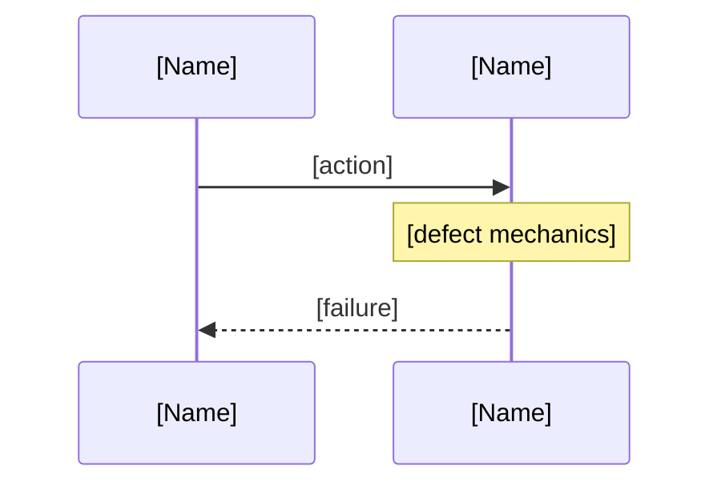

<!-- Copyright 2026. All rights reserved. -->

---
name: adversarial-code-auditor
description: "Pre-emptive adversarial audit of existing code against four correctness risk pillars: memory safety, resource lifecycle, concurrency correctness, and test integrity."
compatibility: "Requires gh CLI and git."
metadata:
  title: "Adversarial Code Auditor (Correctness Risk Pillars)"
  category: auditing
  risk: low
  source: custom
  version: "3.0"
---

# Adversarial Code Auditor

## Architecture

The coordinator dispatches subagents. Each subagent independently reads this skill file, audits one file, applies all rules from this document, and files its own findings via `gh issue create --body-file`. The coordinator only collects URLs. No coordinator prompt variation. Every subagent receives identical dispatch format.

```
Coordinator
  |
  +-> Subagent 1  ->  reads SKILL.md → audits file → files issues → returns URLs
  +-> Subagent 2  ->  reads SKILL.md → audits file → files issues → returns URLs
  +-> Subagent N  ->  reads SKILL.md → audits file → files issues → returns URLs
```

## When to Invoke

- 5+ open bugs in related source files form a correctness cluster
- User provides explicit file paths for a clean-slate audit
- NOT for single runtime bugs (use debug-protocol)
- NOT for spec-to-code gaps (use spec-implementation-auditor)

## The Four Risk Pillars

### 1. Memory Safety (FFI / Native Bridge)
Double-free, UAF, dangling pointers, buffer overflow, signed/unsigned wrap, C++ exception propagation across FFI, NativeFinalizer correctness, mutex/pointer lifetime.

### 2. Resource Lifecycle (GPU / Image / Memory)
Missing dispose(), cache eviction correctness, sync I/O on UI thread, GC churn, socket leaks, HTTP timeouts, GPU overdraw.

### 3. Concurrency Correctness (Async Races / ViewModel State)
ChangeNotifier post-disposal, async type-loading races, state mutation in build(), re-entrant async, missing _disposed guards, TOCTOU, isolate lifecycles.

### 4. Test Integrity (Isolation / Reliability)
FFI/DB-dependent tests, sleep/delayed loops, bare assert(), missing testWidgets, duplicated fakes, flaky assertions.

## Severity Calibration

| Severity | Criteria |
|----------|----------|
| **Critical** | Crashes/leaks from **current code paths**. Reachable from existing callers. |
| **Important** | Wrong behavior, degrades under load, correctness risk in edge cases. |
| **Suggestion** | Forward-looking risk, missing guard, test gap, dead code. Not a bug in current paths. |
| **Nitpick** | Style, naming. No correctness impact. |

**Hard rules:**
- "No validation" is false if ANY guard exists. Read code before claiming absence.
- Stub functions that cannot throw have no exception risk. Do not flag.
- Forward-looking = Suggestion, not Critical.

## UML Diagram Requirements

Critical and Important findings require a Mermaid UML diagram in Section 4.

| Pillar | Defect Pattern | Diagram Type |
|--------|---------------|--------------|
| Memory Safety | UAF / double-free / dangling pointer | sequenceDiagram |
| Memory Safety | Exception crossing FFI | sequenceDiagram |
| Memory Safety | Buffer overflow / signed wrap | classDiagram |
| Resource Lifecycle | Missing dispose / leak | sequenceDiagram |
| Resource Lifecycle | Cache eviction / LRU violation | stateDiagram-v2 |
| Concurrency | ChangeNotifier post-disposal | sequenceDiagram |
| Concurrency | TOCTOU / async race | sequenceDiagram |
| Test Integrity | FFI-dependent test / missing mock | classDiagram |

**UML rules:**
- Sequence diagrams: named lifelines, `alt`/`loop` fragments for branches
- Class diagrams: show relationships, no isolated classes
- State diagrams: `stateDiagram-v2` syntax, transition labels
- Must use ````mermaid` ... ```` fenced blocks. No ASCII art.
- Must trace to file:line references from Section 3.

---

## Issue Body Template

Every finding MUST use this exact structure. All 7 sections are mandatory. No variation.

```
## 1. Context and References
- **File**: `path/to/file.ext:line-line`
- **Pillar**: [Memory Safety | Resource Lifecycle | Concurrency | Test Integrity]
- **Symptom**: [Observable failure caused by this defect]

## 2. Root Cause Analysis (5 Whys)
1. **Why [symptom]?** Because [reason].
2. **Why [reason]?** Because [deeper reason].
3. **Why [deeper reason]?** Because [yet deeper].
4. **Why [yet deeper]?** Because [design/architectural cause].
5. **Why [design cause]?** Because [root systemic cause].

## 3. Correctness Analysis
[Trace the data flow from trigger to failure. Identify the invariant being violated. Reference exact source code lines. Explain the failure mode in concrete terms.]

## 4. UML Diagrams
[MANDATORY for Critical & Important. Omit for Suggestion/Nitpick — write "N/A — Suggestion severity."]



[Fill in real participant names, messages, annotations, and notes. This is a skeleton — replace all bracketed text. Valid mermaid syntax required.]

## 5. Affected Callers / Downstream Impact
- [Caller path or reference] — [how it triggers or is affected by this defect]

## 6. Proposed Correction
[Code snippet showing the fix. Use proper syntax highlighting with language tag.]

## 7. Relationship to Existing Issues
- **Discovered in audit** — new finding.

## Audit Source
Adversarial [Pillar] Audit

SEVERITY: [Critical | Important | Suggestion | Nitpick]
FILE_LOCATION: [path/to/file.ext:line-line]
```

---

## Subagent Execution Protocol

This section is the only instruction subagents follow. Every subagent receives the same protocol. The coordinator dispatch differs only by `[FILE_PATH]`, `[PILLAR]`, and `[MODE]`.

### Pre-audit — Read before starting

1. Read the source file at `[FILE_PATH]`.
2. Read the project constitution at `.pipeline/constitution.md`.
3. For Dart files: read `.pipeline/profiles/flutter.md`.
4. For C++ files: `extern "C"` functions must not throw. Use `snake_case`.

### Audit — Find defects through the pillar lens

1. Read every line of the source file.
2. Apply the `[PILLAR]` focus areas (see "The Four Risk Pillars" above).
3. For every potential defect:
   - Verify it against the source code. Cite exact file:line.
   - Classify severity using the Severity Calibration table.
   - If the code has a guard (try/catch, NaN check, null check), acknowledge it. Do not claim absence.
   - If a stub function cannot throw, do not flag exception risk.
   - If it requires future code changes to trigger, it is Suggestion.
   - If it is Critical or Important, select the UML diagram type from the UML Requirements table.

### Output — Produce the issue body

1. For EVERY finding, produce one issue body using the Issue Body Template exactly as specified above. All 7 sections mandatory. Section headers and field labels must match the template character-for-character.
2. Section 1: Use bullet format with bold field labels. Do not collapse into a single line.
3. Section 2: Exactly 5 Why statements, each beginning with `**Why [text]?** Because [text].`
4. Section 3: Trace the data flow. Cite source lines.
5. Section 4: Critical/Important must have a valid mermaid diagram inside ```mermaid fenced block. Suggestion/Nitpick write "N/A — Suggestion severity."
6. Section 6: Code blocks must use language tags (```cpp, ```dart, etc.).
7. End with SEVERITY and FILE_LOCATION lines.

### File — Create the GitHub issue

1. Write the complete body verbatim to `/tmp/gh_body.md`.
2. Run:
   ```bash
   gh issue create --repo gintatkinson/3dgs-phoenix --title "[AUDIT] [filename]: [finding]" --label "bug" --body-file /tmp/gh_body.md
   ```
3. Title format: `[AUDIT] [filename.ext]: [Brief finding description]`
4. For `[MODE] = bug-based` only: if finding confirms known issue, use `gh issue comment` instead.
5. Sleep 1 second between each issue create.
6. Return the list of created issue URLs with severities. Do NOT return the issue bodies to the coordinator.

### Quality — Self-verify before filing

Before running `gh issue create`, verify:
- [ ] All 7 section headers present (## 1. through ## 7.)
- [ ] Section 1 uses bullet format with `- **File**:`, `- **Pillar**:`, `- **Symptom**:`
- [ ] Section 2 has exactly 5 `**Why [text]?** Because [text].` statements
- [ ] Section 4 has ```mermaid block with valid diagram (Critical/Important) or "N/A — Suggestion severity." (Suggestion/Nitpick)
- [ ] SEVERITY: line present with one of Critical, Important, Suggestion, Nitpick
- [ ] FILE_LOCATION: line present with `path:line-line`
- [ ] No broken code blocks (all ``` are paired)
- [ ] No ASCII art UML — must use ```mermaid fences

---

## Coordinator Dispatch Template

The ONLY variation between subagents is `[FILE_PATH]`, `[PILLAR]`, and `[MODE]`. Every subagent receives this exact dispatch with those three fields filled in:

```
Execute the adversarial-code-auditor skill.

1. Read this file in full: skills/adversarial-code-auditor/SKILL.md
2. Follow the "Subagent Execution Protocol" section exactly.

PARAMETERS:
FILE_PATH: [FILE_PATH]
PILLAR: [PILLAR]
MODE: [MODE]

Proceed through Pre-audit → Audit → Output → File → return URLs. PROCEED
```

## Persistence Rules

- Each file audit uses a fresh subagent. Do not reuse contexts.
- One pillar at a time for signal clarity.
- Subagents file their own issues. Coordinator only collects URLs.
- The coordinator NEVER writes, edits, or extracts issue body text.
- The dispatch template is immutable. Only `[FILE_PATH]`, `[PILLAR]`, `[MODE]` change.
